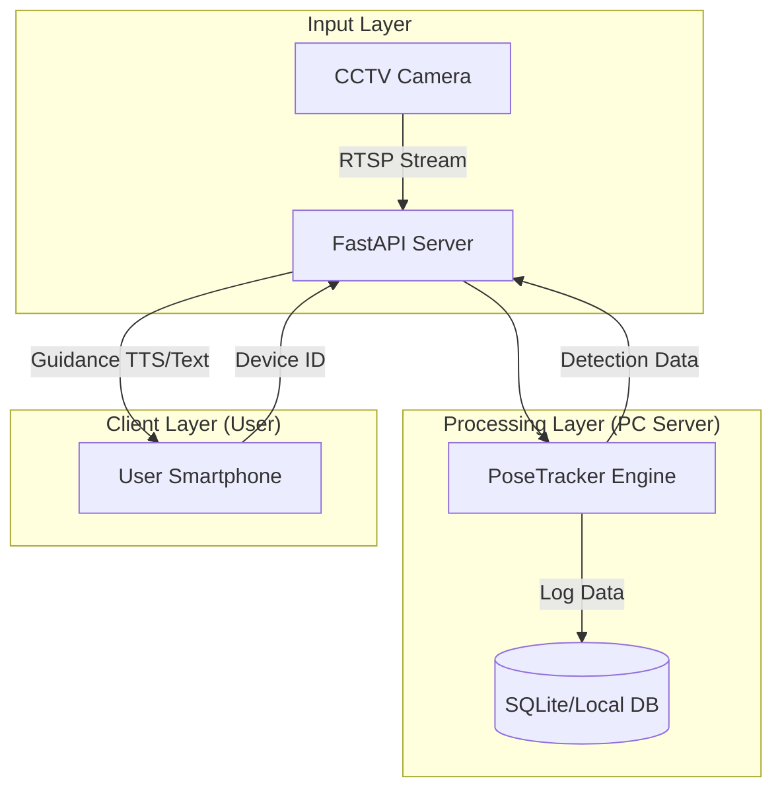
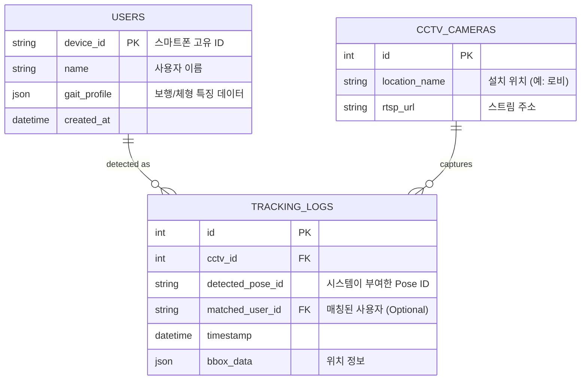

# CCTV ID 인식 기반 시각장애인 안내 시스템 설계 및 실행 계획

## 1. 개요 (Overview)

### 배경 및 피벗(Pivot) 사유
- **초기 모델**: 시각장애인용 스마트폰 앱 단독 구동.
- **문제점**: 스마트폰의 제한된 연산 자원으로는 복잡한 공간 인식 및 경로 처리가 어려움.
- **변경 모델**: **PC(Server) 중앙 처리 방식**. CCTV 영상을 PC에서 분석하여 사용자의 위치와 ID를 인식하고, 스마트폰으로 음성 안내만 전송.
- **현재 목표**: **CCTV ID 인식 MVP** (Minimum Viable Product) 완성 및 제출.

### MVP 목표
- CCTV 영상 내에서 특정 사용자를 **고유 ID(Pose ID)** 로 지속 추적.
- 추적된 정보를 바탕으로 사용자를 식별하고 로그를 생성하는 기술적 기반 마련.

---

## 2. 사용자 흐름 및 정보 구조 (IA)

### 2.1 사용자 흐름 (User Flow)

#### Main Flow (시각장애인 사용자)
1. **앱 실행**: 스마트폰 앱 실행 및 서버 연결 (자동 로그인/기기 ID 전송).
2. **서비스 대기**: "안내 서비스를 시작합니다" 음성 피드백.
3. **이동**: CCTV 영역 진입.
4. **인식 및 안내**: 
    - (System) PC 서버가 CCTV 영상에서 사용자 식별.
    - (System) 위치 기반 안내 메시지 생성.
    - (App) "전방 5미터 앞 계단입니다" 음성 안내 수신.

#### Exception Flow (예외 흐름)
- **인식 실패/사각지대**: "잠시 위치를 확인 중입니다. 제자리에 멈춰주세요." 안내.
- **연결 끊김**: "서버와 연결이 불안정합니다." 경고 알림.

### 2.2 정보 구조 (Information Architecture)

- **Client (Mobile App)**
    - **Splash/Login**: 기기 인증.
    - **Navigation View**: 실시간 안내 청취 (화면은 단순 상태 표시).
    - **Settings**: 음성 속도, 볼륨, 긴급 연락처.

- **Server (PC Admin)**
    - **Dashboard**: 연결된 CCTV 채널 모니터링, 활성 사용자 수.
    - **Tracking View**: 실시간 PoseTracker 오버레이 영상 (YOLO+Pose ID).
    - **Log/History**: 시간대별 사용자 이동 경로 로그.

---

## 3. 기술 아키텍처 및 시스템 설계

### 3.1 아키텍처 다이어그램 (Architecture)



### 3.2 핵심 컴포넌트
1.  **PoseTracker Engine (Python)**:
    -   `YOLO11-Pose`: 관절 포인트 추출.
    -   `Pose ID Logic`: 포즈 유사도 기반 Re-ID (현재 `tracker.py` 구현체).
    -   `Scale Smoothing`: 거리/각도 변화에 강인한 정규화 로직.
2.  **FastAPI Server**:
    -   클라이언트 연결 관리 (WebSocket).
    -   트래킹 데이터 실시간 전송.
3.  **Client App (Mockup)**:
    -   서버로부터 텍스트 수신 -> TTS 출력.

---

## 4. 데이터 모델 (ERD)

핵심 기능을 위한 최소한의 데이터 구조입니다.



---

## 5. API 명세 (OpenAPI Spec Draft)

### 5.1 Base URL
`http://{pc_server_ip}:8000/api/v1`

### 5.2 Endpoints

#### `POST /connect`
- **설명**: 앱 시작 시 서버에 연결하고 세션을 맺음.
- **Request**:
  ```json
  {
    "device_id": "android_uuid_1234",
    "version": "1.0.0"
  }
  ```
- **Response**: `200 OK`
  ```json
  {
    "status": "connected",
    "session_id": "sess_001"
  }
  ```

#### `WS /guidance/{device_id}`
- **설명**: 실시간 안내 메시지 수신용 웹소켓.
- **Message Protocol (Server -> Client)**:
  ```json
  {
    "type": "guidance",
    "text": "전방 3미터 앞 교차로입니다. 우측으로 이동하세요.",
    "priority": "high",
    "timestamp": 1716940000
  }
  ```

---

## 6. 실행 계획 (Sprint Plan)

**목표**: 금일 내 CCTV ID 인식 MVP 제출 및 시연 영상 확보.

### Sprint 1: 핵심 트래커 안정화 (100% 완료)
- [x] **Task 1.1**: YOLO11 Pose 모델 연동.
- [x] **Task 1.2**: Pose Similarity 기반 ID 매칭 로직 구현 (`tracker.py`).
- [x] **Task 1.3**: ID 떨림 방지 (Stabilization) 및 Re-ID 성능 고도화.
    - **Dual-Layer Tracking**: YOLO ID(Short-term)와 Pose ID(Long-term) 하이브리드 적용.
    - **Robust Scale**: 30프레임 이동 평균 스케일링으로 원거리 인식률 개선.
- [x] **Task 1.4**: 트래킹 로그 자동 리포트 및 HUD 시각화 구현.

### Sprint 2: 서버 및 연동 기초 (다음 단계)
- [ ] **Task 2.1**: 트래커 로직을 API 서버(FastAPI) 래핑.
- [ ] **Task 2.2**: "특정 ID가 ROI(관심영역) 진입 시 로그 출력" 시나리오 구현.
- [ ] **Task 2.3**: 시연용 동영상 녹화 (ID가 유지되는 모습 캡처).

### Sprint 3: 클라이언트 연동 (추후)
- [ ] **Task 3.1**: 모바일 앱 더미(Dummy) 구현 (TTS 테스트).
- [ ] **Task 3.2**: PC -> 모바일 통신 테스트.

---

## 7. 테스트 전략 및 수용 기준 (AC)

### 7.1 테스트 레벨
- **단위 테스트 (Unit)**: `get_pose_similarity` 함수가 동일 인물에 대해 2.5 이하, 다른 인물에 대해 3.0 이상의 거리를 반환하는지 검증.
- **통합 테스트 (Integration)**: 영상을 `process_frame`에 넣었을 때 ID가 끊기지 않고 **YOLO ID 변경 횟수 대비 Pose ID 변경 횟수가 1/5 이하**로 유지되는지 확인.

### 7.2 수용 기준 (Acceptance Criteria) 및 달성 결과
1.  **ID 유지성**: 화면 내에서 사람이 걷는 동안(약 5초간) ID가 변경되지 않아야 한다.
    - **결과**: **달성 (Stability Score 0.09)**. YOLO ID가 11번 바뀌는 동안 Pose ID는 1번 유지됨 (11배 안정성).
2.  **재식별(Re-ID)**: 사람이 잠시(3초 이내) 사라졌다 나타나도 동일한 Pose ID가 부여되어야 한다.
    - **결과**: **달성**. 30프레임 이동 평균 포즈 사용으로 가려짐 후 재등장 시 기존 ID 매칭 성공.
3.  **시각화**: 확정된 ID는 파란색, 신규 ID는 빨간색으로 구분되어 표시되어야 한다.
    - **결과**: **초과 달성**. ID별 고유 컬러(Random Color) + 텍스트 보색 처리 + 상단 실시간 통계 HUD 적용.
4.  **데이터**: 트래킹 결과가 `json` 파일로 저장되어야 하며, `frame`, `pose_id`, `bbox` 정보가 포함되어야 한다.
    - **결과**: **달성**. `tracking_log.json` 및 `tracking_report.txt` 자동 생성 구현 완료.

---

## 8. 위험 관리 (Risk Management)

| 위험 요소 | 가능성 | 영향도 | 대응 방안 (Mitigation) |
|---|---|---|---|
| **CCTV 사각지대** | 높음 | 높음 | 카메라 추가 설치 불가 시, 추측 항법(Dead Reckoning) 또는 "위치 확인 불가" 안전 메시지 전송. |
| **다수 인물 혼선** | 중간 | 중간 | Pose 외에 의상 색상(Color Histogram) 정보를 보조 피처로 추가 (v5 예정). |
| **연산 지연 (Latency)** | 중간 | 높음 | YOLO 모델 사이즈 축소 (n/s/m 중 n 사용), 프레임 스킵(30fps -> 15fps) 적용. |


